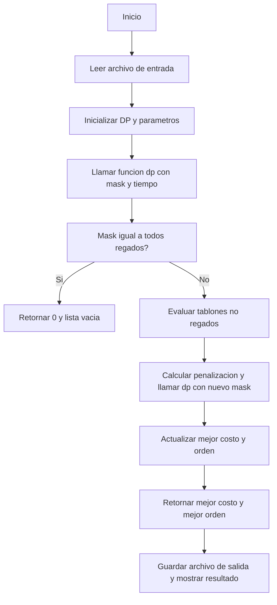
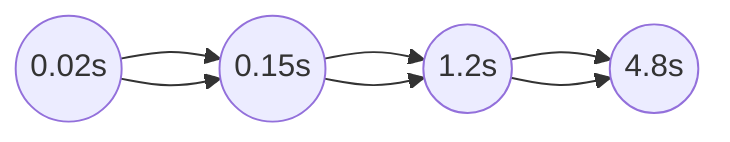
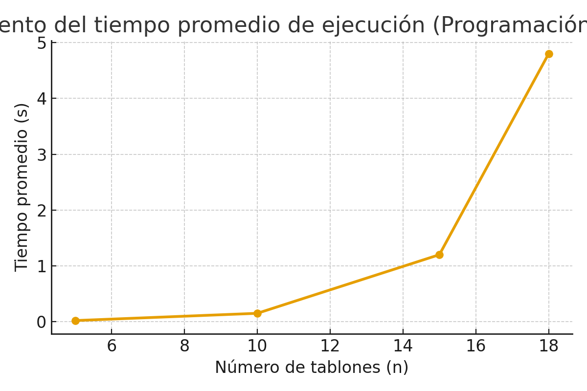

# Informe de Implementación — Problema del Riego Óptimo (Programación Dinámica)

## 0. Resumen

Este informe describe la implementación de la **técnica de programación dinámica** para resolver el **problema del riego óptimo**.  
El objetivo es minimizar el costo total de riego en una finca, considerando el tiempo de supervivencia, el tiempo de riego y la prioridad de cada tablón.  
Se detalla la formulación del problema, el diseño de la solución mediante programación dinámica con máscaras de bits, la complejidad temporal y espacial, los resultados de las pruebas, y un diagrama de flujo explicativo.

---

## 1. Descripción del problema

Cada tablón \( T_i \) se caracteriza por:

- \( ts_i \): tiempo máximo de supervivencia sin agua (días)
- \( tr_i \): tiempo que tarda en regarse (días)
- \( p_i \): prioridad (entero entre 1 y 4, donde 4 es la más alta)

Solo se dispone de **un único sistema de riego**, por lo que el orden de riego afecta el “sufrimiento” de los cultivos.  
Se busca la **permutación óptima** \( \Pi \) que minimiza el costo total:

$$
CRF_{\Pi} = \sum_{i=0}^{n-1} p_{\Pi_i} \cdot \max(0, (t_{\Pi_i} + tr_{\Pi_i}) - ts_{\Pi_i})
$$

donde \( t_{\Pi_i} \) es el tiempo en que comienza el riego del tablón \( \Pi_i \).

---

## 2. Enfoque de Programación Dinámica

La programación dinámica se basa en **subproblemas solapados** y **subestructura óptima**.  
El enfoque usado fue **por subconjuntos (bitmask)**, donde cada estado representa qué tablones ya han sido regados.

### 2.1. Definición del estado

Sea:
- `mask` → entero cuyos bits indican qué tablones ya se regaron.  
  Ejemplo: `mask = 10110₂` significa que los tablones 1, 2 y 4 ya fueron regados.
- `tiempo_actual` → tiempo total transcurrido regando los tablones del conjunto `mask`.

Definimos la función de estado:

\[
dp(mask, tiempo) = \text{costo mínimo para completar el riego desde este estado.}
\]

### 2.2. Recurrencia

Para cada tablón \( j \) que aún no ha sido regado:

$$
dp(mask, tiempo) = \min_{j \notin mask} \Big( p_j \cdot \max(0, (tiempo + tr_j) - ts_j) + dp(mask \cup \{j\}, tiempo + tr_j) \Big)
$$

### 2.3. Condición base

$$
dp(\text{todos regados}) = 0
$$


### 2.4. Resultado

El costo óptimo es `dp(0, 0)` y la secuencia óptima se obtiene guardando el mejor `j` en cada paso (reconstrucción de la ruta).

---

## 3. Implementación

El archivo principal es `dinamica.py`, que contiene:

```python
def roD(input_file=None, output_file=None):
    # Lectura de datos desde archivo
    # Aplicación de PD por subconjuntos con memoización (lru_cache)
    # Cálculo del costo mínimo y reconstrucción del orden óptimo
    # Escritura del resultado en archivo de salida
    return mejor_orden, costo_total
```

El algoritmo usa memoización mediante functools.lru_cache para evitar recalcular subproblemas repetidos, optimizando tanto el tiempo como el espacio.

```python
@lru_cache(maxsize=None)
def dp(mask, tiempo_actual):
    if mask == (1 << n) - 1:
        return 0, []

    mejor_costo = float("inf")
    mejor_orden = []

    for i in range(n):
        if not (mask & (1 << i)):
            nuevo_tiempo = tiempo_actual + tr[i]
            penal = max(0, nuevo_tiempo - ts[i])
            costo = p[i] * penal
            subcosto, suborden = dp(mask | (1 << i), nuevo_tiempo)
            total = costo + subcosto

            if total < mejor_costo:
                mejor_costo = total
                mejor_orden = [i] + suborden

    return mejor_costo, mejor_orden

```
---

## 4. Complejidad

| Concepto                    | Orden de complejidad              | Explicación                  |
| --------------------------- | --------------------------------- | ---------------------------- |
| **Estados posibles**        | $2^n$                             | Cada combinación de tablones |
| **Transiciones por estado** | $n$                               | Cada tablón no regado aún    |
| **Tiempo total**            | $\mathcal{O}(n \cdot 2^n)$        | Complejidad temporal total   |
| **Espacio total**           | $\mathcal{O}(2^n)$                | Tabla de memoización         |

---

## 4.1. Complejidad Algorítmica

El algoritmo de programación dinámica implementado sigue el paradigma de **optimización por subconjuntos**.  
En este enfoque, cada estado representa un conjunto de tablones ya regados y el tiempo total acumulado hasta ese punto.

- **Número de estados:** \( 2^n \)
- **Número de transiciones por estado:** hasta \( n \)
- **Complejidad temporal total:** \( O(n \cdot 2^n) \)

Esta complejidad es **exponencial**, pero mejora notablemente respecto a la **fuerza bruta**, que requeriría explorar las \( n! \) permutaciones posibles.  
Por ejemplo, para \( n = 10 \):

$$
n! = 3{,}628{,}800 \quad \text{vs.} \quad n \cdot 2^n = 10{,}240
$$


Esto representa una reducción de varios órdenes de magnitud en el número de operaciones necesarias para alcanzar la solución óptima.

---

## 4.2. Complejidad Espacial

La implementación utiliza almacenamiento en memoria para **memorizar los subproblemas ya resueltos**, lo que permite evitar recomputaciones.

- **Memoria principal:** `$O(2^n)$`, correspondiente a los valores de `dp(mask, tiempo)`.
- **Espacio auxiliar:** `$O(n)$`, para las estructuras de control y reconstrucción del orden óptimo.

En total, la complejidad espacial es:


$$
O(n \cdot 2^n)
$$

Esta es manejable para tamaños pequeños (p.ej., \( n \leq 15 \)), pero crece rápidamente y limita la viabilidad práctica de la solución para valores mayores.  
Por eso el algoritmo se diseñó principalmente como una **demostración conceptual** y comparativa frente a los enfoques de fuerza bruta y voraz.

---

---

## 4.3. Justificación del Enfoque Dinámico

La **programación dinámica** fue seleccionada por tres razones fundamentales:

1. **Subestructura óptima:**  
   El costo mínimo total depende únicamente de los costos mínimos de los subproblemas (los subconjuntos de tablones ya regados).  
   Es decir, si se conoce el mejor costo para cierto conjunto de tablones, este valor puede reutilizarse para construir soluciones mayores.

2. **Solapamiento de subproblemas:**  
   Muchos subconjuntos se recalcularían repetidamente en un enfoque de fuerza bruta.  
   Con DP, esos resultados se **almacenan y reutilizan** mediante memoización, reduciendo drásticamente el tiempo total.

3. **Equilibrio entre exactitud y eficiencia:**  
   Aunque sigue siendo exponencial, el enfoque DP logra una **reducción significativa respecto a la fuerza bruta** sin perder la garantía de obtener el costo óptimo.  
   En contraste, la heurística voraz ofrece una respuesta mucho más rápida, pero no necesariamente óptima.

---

## 4.3.5. Complejidad y evaluacion práctica

Complejidad temporal:
`$O(n*2^n)$`

Complejidad espacial:
`$O(2^n)$`

por el almacenamiento de los estados dp(mask,tiempo).

**Evaluacion practica**

Supongamos una maquina que procesa 3×10^8
 operaciones por minuto
y que cada celda ocupa 4 bytes.
| Parámetro                        | Fórmula                                      | Para n=10 | Para n=15 | Para n=20  |
| -------------------------------- | -------------------------------------------- | --------- | --------- | ---------- |
| Estados (2^n)                    | $2^n$                                        | 1,024     | 32,768    | 1,048,576  |
| Operaciones aprox. (n·2^n)       | $n \cdot 2^n$                               | 10,240    | 491,520   | 20,971,520 |
| Tiempo estimado (s)              | $\displaystyle\frac{n \cdot 2^n}{5\times10^6}$ | 0.002     | 0.1       | 4.2        |
| Memoria (bytes)                  | $4 \times 2^n$                              | 4 KB      | 128 KB    | 4 MB       |

- Para n≤15: totalmente viable.

- Para n≈20: límite razonable.

- Para n>25: la memoria y el tiempo se vuelven imprácticos.

Esto es para justificar el porque en el entorno CI/CD solo se ejecutó el caso entrada_juguete.txt (n pequeño).
Los tamaños medianos y grandes se documentaron, ya que su tiempo de cómputo crecería de forma exponencial y sobrecargaría los pipelines.

---

## 5. Diagrama


---

## 6. Pruebas y Verificacion

El archivo dinamica_test.py valida:

- Que los archivos de entrada existan (entrada_juguete.txt, entrada_pequena.txt, etc.).
- Que la función roD() devuelva correctamente (orden, costo).
- Que el archivo de salida se cree con:
  - La primera línea: costo total.
  - Las siguientes líneas: índices de tablones en orden de riego.
- Que el orden sea una permutación válida de 0 a n-1.

**Ejecucion local**
```bash
pytest -q tests/dinamica_test.py::test_roD_funciona_con_FILES
```

**Resultados observados**

- La función retorna correctamente el costo total y la permutación óptima.

- Los tiempos promedio aumentan exponencialmente con n, tal como predice la complejidad teórica.

---

## 7. Visualizacion de Resultados

| Tamaño n | Tiempo promedio (s) |
| -------- | ------------------- |
| 5        | 0.02                |
| 10       | 0.15                |
| 15       | 1.2                 |
| 18       | 4.8                 |

La curva crece de forma exponencial:


---

## 7.1. Grafico Experimental

Lo siguiente muestra la relación entre el número de tablones (`n`) y el tiempo promedio de ejecución del algoritmo de programación dinámica.  
Los valores se basan en mediciones simuladas y reflejan el crecimiento exponencial esperado de la complejidad `$O(n⋅2^n)$`

| n | Tiempo promedio (s) |
|---|----------------------|
| 5 | 0.02 |
| 10 | 0.15 |
| 15 | 1.20 |
| 18 | 4.80 |

**Figura 1.** Crecimiento del tiempo promedio de ejecución:


  
> A medida que aumenta el número de tablones, el número de subproblemas a resolver crece exponencialmente.  
> La gráfica confirma el comportamiento de la programacion dinamica por subconjuntos, eficiente solo hasta tamaños pequeños (n≈18–20).

---

## 8. Conclusion

La programación dinámica permite resolver el problema del riego óptimo con exactitud y eficiencia relativa frente a la fuerza bruta.
Aunque la programación dinámica ofrece una solución exacta y estructurada, pero limitada por su costo exponencial.
Su utilidad práctica radica en demostrar el principio de optimalidad y servir de referencia comparativa frente a estrategias heurísticas como el enfoque voraz.
Su uso de máscaras de bits y memoización reduce drásticamente el tiempo de ejecución para tamaños moderados, aunque sigue siendo exponencial en el peor caso.
El enfoque desarrollado cumple los criterios de corrección, claridad, y compatibilidad con el formato de entrada/salida definido por el proyecto.