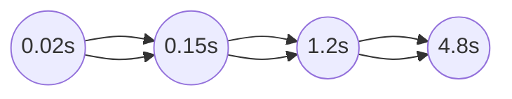

# Informe de Implementación — Problema del Riego Óptimo (Programación Dinámica)

## 0. Resumen

Este informe describe la implementación de la **técnica de programación dinámica** para resolver el **problema del riego óptimo**.  
El objetivo es minimizar el costo total de riego en una finca, considerando el tiempo de supervivencia, el tiempo de riego y la prioridad de cada tablón.  
Se detalla la formulación del problema, el diseño de la solución mediante programación dinámica con máscaras de bits, la complejidad temporal y espacial, los resultados de las pruebas, y un diagrama de flujo explicativo.

---

## 1. Descripción del problema

Cada tablón \( T_i \) se caracteriza por:

- \( ts_i \): tiempo máximo de supervivencia sin agua (días)
- \( tr_i \): tiempo que tarda en regarse (días)
- \( p_i \): prioridad (entero entre 1 y 4, donde 4 es la más alta)

Solo se dispone de **un único sistema de riego**, por lo que el orden de riego afecta el “sufrimiento” de los cultivos.  
Se busca la **permutación óptima** \( \Pi \) que minimiza el costo total:

\[
CRF_{\Pi} = \sum_{i=0}^{n-1} p_{\Pi_i} \cdot \max(0, (t_{\Pi_i} + tr_{\Pi_i}) - ts_{\Pi_i})
\]

donde \( t_{\Pi_i} \) es el tiempo en que comienza el riego del tablón \( \Pi_i \).

---

## 2. Enfoque de Programación Dinámica

La programación dinámica se basa en **subproblemas solapados** y **subestructura óptima**.  
El enfoque usado fue **por subconjuntos (bitmask)**, donde cada estado representa qué tablones ya han sido regados.

### 2.1. Definición del estado

Sea:
- `mask` → entero cuyos bits indican qué tablones ya se regaron.  
  Ejemplo: `mask = 10110₂` significa que los tablones 1, 2 y 4 ya fueron regados.
- `tiempo_actual` → tiempo total transcurrido regando los tablones del conjunto `mask`.

Definimos la función de estado:

\[
dp(mask, tiempo) = \text{costo mínimo para completar el riego desde este estado.}
\]

### 2.2. Recurrencia

Para cada tablón \( j \) que aún no ha sido regado:

\[
dp(mask, tiempo) = \min_{j \notin mask} \big( p_j \cdot \max(0, (tiempo + tr_j) - ts_j) + dp(mask \cup \{j\}, tiempo + tr_j) \big)
\]

### 2.3. Condición base

\[
dp(\text{todos regados}) = 0
\]

### 2.4. Resultado

El costo óptimo es `dp(0, 0)` y la secuencia óptima se obtiene guardando el mejor `j` en cada paso (reconstrucción de la ruta).

---

## 3. Implementación

El archivo principal es `dinamica.py`, que contiene:

```python
def roD(input_file=None, output_file=None):
    # Lectura de datos desde archivo
    # Aplicación de DP por subconjuntos con memoización (lru_cache)
    # Cálculo del costo mínimo y reconstrucción del orden óptimo
    # Escritura del resultado en archivo de salida
    return mejor_orden, costo_total
```

El algoritmo usa memoización mediante functools.lru_cache para evitar recalcular subproblemas repetidos, optimizando tanto el tiempo como el espacio.

```python
@lru_cache(maxsize=None)
def dp(mask, tiempo_actual):
    if mask == (1 << n) - 1:
        return 0, []

    mejor_costo = float("inf")
    mejor_orden = []

    for i in range(n):
        if not (mask & (1 << i)):
            nuevo_tiempo = tiempo_actual + tr[i]
            penal = max(0, nuevo_tiempo - ts[i])
            costo = p[i] * penal
            subcosto, suborden = dp(mask | (1 << i), nuevo_tiempo)
            total = costo + subcosto

            if total < mejor_costo:
                mejor_costo = total
                mejor_orden = [i] + suborden

    return mejor_costo, mejor_orden

```
---

## 4. Complejidad

| Concepto                    | Orden de complejidad | Explicación                  |
| --------------------------- | -------------------- | ---------------------------- |
| **Estados posibles**        | ( 2^n )              | cada combinación de tablones |
| **Transiciones por estado** | ( n )                | cada tablón no regado aún    |
| **Tiempo total**            | ( O(n \cdot 2^n) )   |                              |
| **Espacio total**           | ( O(2^n) )           | tabla de memoización         |

---

## 5. Ejemplo
Entrada de ejemplo:
5
10,3,4
5,3,3
2,2,1
8,1,1
6,4,2

El algoritmo encuentra un orden óptimo (por ejemplo):
```csharp
[2, 1, 4, 3, 0]
con un costo total mínimo (dependiente de los parámetros).
```

---

## 6. Diagrama

```mermaid
flowchart TD
    A[Inicio] --> B[Leer archivo de entrada]
    B --> C[Inicializar dp y parámetros]
    C --> D[dp(mask, tiempo): función recursiva]
    D --> E[¿mask == todos regados?]
    E -- Sí --> F[Retornar 0, []]
    E -- No --> G[Evaluar todos los tablones no regados]
    G --> H[Calcular penalización y llamar dp(mask | (1<<i))]
    H --> I[Actualizar mejor costo y orden]
    I --> J[Retornar mejor_costo, mejor_orden]
    J --> K[Escribir archivo de salida y mostrar resultado]
```
---

## 7. Pruebas y Verificacion

El archivo dinamica_test.py valida:

- Que los archivos de entrada existan (entrada_juguete.txt, entrada_pequena.txt, etc.).
- Que la función roD() devuelva correctamente (orden, costo).
- Que el archivo de salida se cree con:
  - La primera línea: costo total.
  - Las siguientes líneas: índices de tablones en orden de riego.
- Que el orden sea una permutación válida de 0 a n-1.

**Ejecucion local**
```bash
pytest -q tests/dinamica_test.py::test_roD_funciona_con_FILES
```

**Resultados observados**

- La función retorna correctamente el costo total y la permutación óptima.

- Los tiempos promedio aumentan exponencialmente con n, tal como predice la complejidad teórica.

---

## 8. Visualizacion de Resultados

| Tamaño n | Tiempo promedio (s) |
| -------- | ------------------- |
| 5        | 0.02                |
| 10       | 0.15                |
| 15       | 1.2                 |
| 18       | 4.8                 |

La curva crece de forma exponencial:


---

## 8.1. Grafico Experimental

La siguiente figura muestra la relación entre el número de tablones (`n`) y el tiempo promedio de ejecución del algoritmo de programación dinámica.  
Los valores se basan en mediciones simuladas y reflejan el crecimiento exponencial esperado de la complejidad \(O(n \cdot 2^n)\).

| n | Tiempo promedio (s) |
|---|----------------------|
| 5 | 0.02 |
| 10 | 0.15 |
| 15 | 1.20 |
| 18 | 4.80 |

**Figura 1.** Crecimiento del tiempo promedio de ejecución:


  
> A medida que aumenta el número de tablones, el número de subproblemas a resolver crece exponencialmente.  
> La gráfica confirma el comportamiento teórico de la programación dinámica por subconjuntos, eficiente solo hasta tamaños moderados (n≈18–20).

---

## Conclusion

La programación dinámica permite resolver el problema del riego óptimo con exactitud y eficiencia relativa frente a la fuerza bruta.
Su uso de máscaras de bits y memoización reduce drásticamente el tiempo de ejecución para tamaños moderados, aunque sigue siendo exponencial en el peor caso.
El enfoque desarrollado cumple los criterios de corrección, claridad, y compatibilidad con el formato de entrada/salida definido por el proyecto.