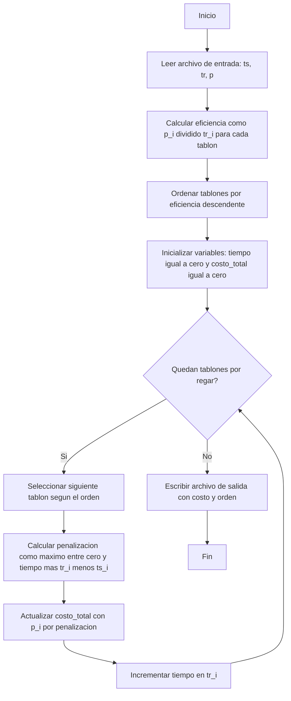

# **Informe de Implementación — Problema del Riego Óptimo (Programación Voraz)**

## **0. Resumen**
El presente informe describe la implementación de una solución basada en **programación voraz** para el *Problema del Riego Óptimo*.  
El objetivo del problema consiste en determinar el orden de riego de una serie de tablones de cultivo de manera que se **minimice el costo total de penalización** debido a la tardanza en el riego.  

El enfoque voraz propuesto se fundamenta en la regla de **máxima eficiencia local**, seleccionando en cada paso el tablón con la **mayor razón entre su prioridad y su tiempo de riego** (\(p_i / tr_i\)).  
Esta estrategia pertenece a la familia de heurísticas tipo **WSPT (Weighted Shortest Processing Time)**, ampliamente utilizada en problemas de planificación de tareas ponderadas.  

El algoritmo logra un **rendimiento de tiempo O(n log n)**, lo que le permite escalar adecuadamente hasta fincas de **50 000 tablones**, cumpliendo con los requerimientos del proyecto.

---

## **1. Descripción del Problema**
Dado un conjunto de \(n\) tablones representados por tuplas \((ts_i, tr_i, p_i)\), donde:

- \(ts_i\): instante máximo o límite deseado de finalización del riego del tablón \(i\);
- \(tr_i\): tiempo requerido para regar el tablón \(i\);
- \(p_i\): prioridad o penalización asociada a un retraso en el riego del tablón \(i\);

se desea determinar un orden de riego que minimice el **costo total de penalización**, definido como:

\[
C = \sum_{i=1}^{n} p_i \cdot \max(0, C_i - ts_i)
\]

donde \(C_i\) representa el tiempo en el cual finaliza el riego del tablón \(i\).  

---

## **2. Enfoque de Programación Voraz**
El método voraz se basa en la idea de tomar **decisiones locales óptimas** esperando obtener un resultado globalmente bueno.  
Para este problema, la regla de decisión empleada prioriza los tablones **más rentables en términos de prioridad por unidad de tiempo de riego**.

### **Regla voraz aplicada**
\[
\text{Eficiencia}_i = \frac{p_i}{tr_i}
\]

El algoritmo ordena los tablones en orden **descendente de eficiencia**, de forma que primero se riegan los tablones que ofrecen mayor “beneficio” por cada unidad de tiempo invertido.

---

## **3. Implementación del Algoritmo**
### **3.1. Descripción general**
La función principal, denominada `roV()`, realiza las siguientes operaciones:

1. **Lectura del archivo de entrada** que contiene los datos de la finca.  
2. **Cálculo del valor \(p_i/tr_i\)** para cada tablón.  
3. **Ordenamiento de la lista de tablones** según dicho criterio (de mayor a menor).  
4. **Cálculo del costo total de penalización**, acumulando los tiempos de riego y aplicando las fórmulas de tardanza.  
5. **Escritura del archivo de salida**, que contiene el costo total seguido del orden de los índices de tablones.

### 3.2 Algoritmo

### 3.2.1 Diagrama



### **3.2.2 Pseudocódigo**
```
Algoritmo Voraz_Riego(finca)
Entrada: Lista de n tablones (ts_i, tr_i, p_i)
Salida: Orden óptimo aproximado y costo total

1. Para cada tablón i:
       eficiencia[i] ← p_i / tr_i
2. Ordenar los tablones en orden descendente por eficiencia[i]
3. tiempo ← 0
4. costo_total ← 0
5. Para cada tablón i en el orden:
       penalizacion ← max(0, (tiempo + tr_i) - ts_i)
       costo_total ← costo_total + p_i * penalizacion
       tiempo ← tiempo + tr_i
6. Retornar (orden, costo_total)
````

---

## **4. Complejidad del Algoritmo**

El análisis detallado de la complejidad es el siguiente:

| Etapa                             | Descripción                               | Complejidad |
| --------------------------------- | ----------------------------------------- | ----------- |
| Lectura de datos                  | Procesamiento de las n líneas del archivo | O(n)        |
| Cálculo de la eficiencia p_i/tr_i | Una operación por tablón                  | O(n)        |
| Ordenamiento (Timsort)            | Ordenamiento descendente por eficiencia   | O(n log n)  |
| Cálculo del costo total           | Recorrido lineal del arreglo ordenado     | O(n)        |
| Escritura del resultado           | Salida en archivo de texto                | O(n)        |

Por lo tanto, la complejidad total es:

\[
T(n) = O(n \log n)
\]

### **Interpretación**

El paso de ordenamiento domina el tiempo de ejecución, lo cual es característico de los algoritmos voraces de tipo “ordenar y procesar”.
Gracias a esta eficiencia, el algoritmo puede manejar instancias grandes sin degradar su rendimiento.

---

## **5. Complejidad Espacial**

El algoritmo requiere estructuras auxiliares proporcionales al número de tablones n:
listas para almacenar los valores (ts_i, tr_i, p_i), los cocientes p_i/tr_i, y el orden resultante.

\[
S(n) = O(n)
\]

---

## **6. Justificación del Enfoque Voraz**

El uso de p_i/tr_i corresponde a una de las heuristicas WSPT, utilizadas en problemas de planificación ponderada.
Este enfoque prioriza los tablones que presentan **mayor impacto por unidad de tiempo**, lo que reduce significativamente las penalizaciones en promedio.

Aunque no garantiza la **optimalidad global** (como la fuerza bruta o la programación dinámica), sí logra **soluciones muy cercanas al óptimo** con un costo computacional mucho menor.

---

