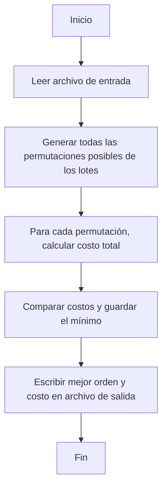

# Informe del Algoritmo de Fuerza Bruta (roFB)

## 1. Introducción

El algoritmo roFB implementa evalua todas las posibles permutaciones de orden de riego para determinar cuál de estás minimiza el costo total asociado a penalizaciones por retraso osease, minimizar el sufrimiento al demorarse mucho en regar un tablon.

Este enfoque, aunque muy costozo y no recomendable para cantidades grandes de datos, garantiza encontrar la solución óptima al problema.

---

## 2. Descripción del Algoritmo

El algoritmo recibe como entrada un archivo `.txt` con el siguiente formato:

```
n
ts1,tr1,p1
ts2,tr2,p2
...
```

donde:
- \( n \): número de lotes a regar.  
- \( ts_i \): tiempo sugerido de inicio del riego del lote \( i \).  
- \( tr_i \): duración del riego del lote \( i \).  
- \( p_i \): penalización por unidad de tiempo de retraso del lote \( i \).

El algoritmo genera todas las permutaciones posibles del orden de riego y calcula el costo total para cada una, seleccionando la de menor valor.

---

## 3. Pseudocódigo



---

## 4. Cálculo del Costo

Para una secuencia de riego \( S = [s_1, s_2, ... , s_n] \), el costo total se define como:

```math
C(S) = \sum_{i=1}^{n} p_{s_i} \cdot \max(0,\ (T_i + tr_{s_i}) - ts_{s_i})
```

donde:
### \( T_i \) es el tiempo acumulado antes de regar el lote \( s_i \).  
### \( tr_{s_i} \) es el tiempo requerido para regar dicho lote.  
### \( ts_{s_i} \) es el tiempo sugerido de inicio.  

El algoritmo busca minimizar \( C(S) \) explorando todas las permutaciones posibles de \( S \).

---

## 5. Complejidad Computacional

### **Número de permutaciones posibles**:  
  \[
  n!
  \]
### **Costo por evaluación de cada permutación**:  
  \[
  O(n)
  \]
### **Complejidad total**:  
  \[
  O(n * n!) = O(n!)
  \]

Esto implica que el algoritmo se vuelve ineficiente para valores grandes de \( n \), pero asegura una solución exacta.

---

## 6. Contrato mínimo de la implementación (inputs/outputs)

- Entrada: archivo de texto con formato:  
  - Primera línea: n (# tablones).  
  - Siguientes n líneas: ts,tr,p separados por comas.  

- Salida: par (orden, costo) donde:  
  - orden es una lista de índices (0..n-1) con el orden de riego óptimo.  
  - costo es el valor entero del costo total.  
  - También se escribe un archivo de salida con el costo en la primera línea y luego los índices en líneas posteriores.  


---

## 7. Implementación (resumen de funciones)

- Función: roFB(input_file=None, output_file=None)  
  - Lee la finca desde input_file (o pide diálogo si no se provee y tkinter está disponible).  
  - Genera todas las permutaciones posibles usando itertools.permutations.  
  - Calcula el costo total para cada orden.  
  - Escribe el resultado en output_file.  
  - Devuelve (orden_lista, costo_total).

---

## 8. Verificación y pruebas

- Tests implementados: main/tests/bruta_test.py  
  - Verifica existencia de archivos de entrada.  
  - Llama a roFB(input, output) y confirma:  
    - Que orden sea lista y costo entero.  
    - Que el archivo de salida contenga costo en la primera línea y luego los índices del orden.  
    - Que los índices formen una permutación válida (0..n-1).  

### **Ejecutar pruebas localmente (PowerShell o terminal):**
```bash
python -m pip install pytest
pytest python -m pytest -v
```

---

## 9. Conclusiones

- El algoritmo de Fuerza Bruta garantiza la solución óptima, pero su complejidad factorial limita su aplicabilidad a instancias pequeñas.  
- Sirve como referencia de validación para comparar la precisión de los métodos voraz y dinámico.  
- Es ideal para fases de experimentación y prueba, no para ejecución en producción, por lo que es recomendable solo reproducirlo usando la *entrada_juguete.txt*.

---